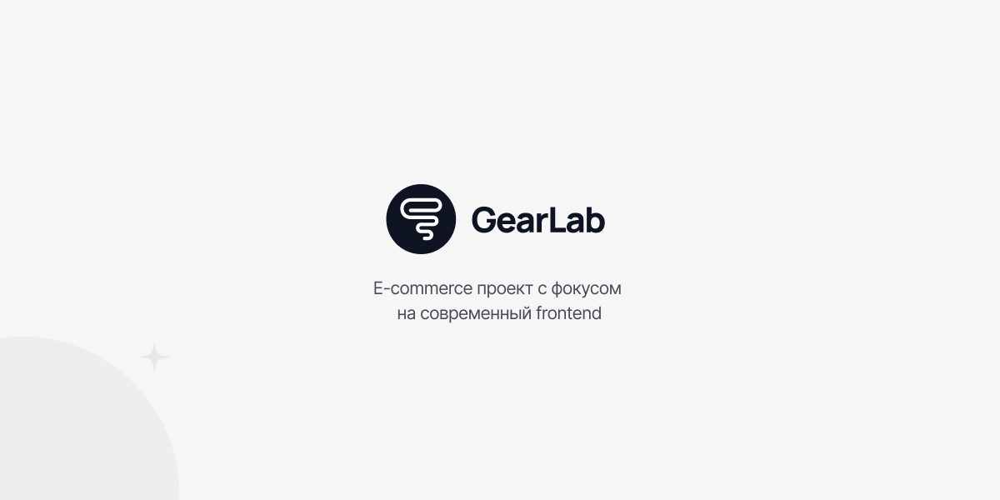

🌐 README доступна на нескольких языках:

- [Русский](README.md)
- [English](README.en.md)

# 🛒 GearLab E-commerce

<p align="center">
  
</p>

Современный, адаптивный интернет-магазин, созданный с использованием Next.js,
React и Tailwind CSS. Проект реализует исключительно frontend-часть и включает
каталог товаров, корзину покупок, аутентификацию пользователей и чистый,
интуитивно понятный пользовательский интерфейс.

## 🚀 Live Demo

🔗 https://gearlab-ecommerce.vercel.app

Задеплоенная демо-версия проекта, предназначенная для демонстрации
пользовательского интерфейса, адаптивности и архитектуры frontend-приложения.

## 📌 Обзор проекта

GearLab E-commerce — это демонстрационный онлайн-магазин, разработанный для
показа широкого спектра практик frontend-разработки и UI/UX-паттернов.
Приложение позволяет пользователям просматривать товары, изучать подробную
информацию о них, управлять корзиной и имитировать процесс оформления заказа.

Проект не является production-решением. Основной фокус сделан на архитектуре
интерфейса, UX-паттернах, доступности и современных подходах к разработке React
/ Next.js-приложений.

### ✨ Ключевые возможности

- **Каталог товаров** 📦: Просмотр ассортимента с возможностью фильтрации
  (например, по цене или категории).
- **Карточка товара** 🧾: Детальная информация о товаре, включая описание,
  изображения и доступные опции.
- **Корзина покупок** 🛍️: Добавление, обновление и удаление товаров.
- **Процесс оформления заказа** 💳: Упрощённый сценарий имитации размещения
  заказа.
- **Аутентификация пользователей** 🔐: Страницы входа, регистрации,
  восстановления и сброса пароля.
- **Управление аккаунтом пользователя** 👤: Заготовки для профиля пользователя,
  истории заказов и списков желаемого.
- **Адаптивный дизайн** 📱💻: Оптимизация под различные размеры экранов.
- **Современные UI-компоненты** 🎨: Использование shadcn/ui для создания
  доступных и настраиваемых интерфейсов.

## 🧰 Используемые технологии

Проект основан на современном стеке веб-технологий:

- **Фреймворк** ⚙️: [Next.js 16](https://nextjs.org/)
- **Библиотека** ⚛️: [React 19](https://react.dev/)
- **Язык** 🧠: [TypeScript](https://www.typescriptlang.org/)
- **Стилизация** 🎨: [Tailwind CSS](https://tailwindcss.com/)

### 🔧 Основные библиотеки и инструменты

- **UI-компоненты** 🧩: [shadcn/ui](https://ui.shadcn.com/)
- **Иконки** 🖼️: `lucide-react`
- **Уведомления** 🔔: `sonner`
- **Анимации** 🎞️: `tw-animate-css`
- **Линтинг** 🧹: [ESLint](https://eslint.org/)

## 🗄️ Источник данных (локальный JSON API)

В демонстрационных целях проект использует локальные JSON-файлы
(`data/products.json`, `data/reviews.json` и т.д.) для имитации backend API.
Такой подход позволяет получить полностью функциональный frontend без
необходимости в реальном сервере и подчёркивает ориентацию проекта именно на
UI-логику и управление состоянием.

## 💻 Начало работы (локальная разработка)

Этот раздел предназначен для локального запуска проекта и ознакомления с кодовой
базой. Для просмотра готового интерфейса используйте ссылку на Live Demo.

Чтобы запустить проект локально, выполните следующие шаги:

1.  **Клонируйте репозиторий**:
    ```bash
    git clone https://github.com/NestleeQ/gearlab-ecommerce.git
    cd gearlab-ecommerce
    ```
2.  **Установите зависимости**:
    ```bash
    npm install
    ```
3.  **Запустите сервер разработки**:
    ```bash
    npm run dev
    ```
    Откройте [http://localhost:3000](http://localhost:3000) в браузере, чтобы
    увидеть приложение.

## 📄 Лицензия

Проект распространяется по лицензии MIT — подробности см. в файле
[LICENSE](LICENSE)
